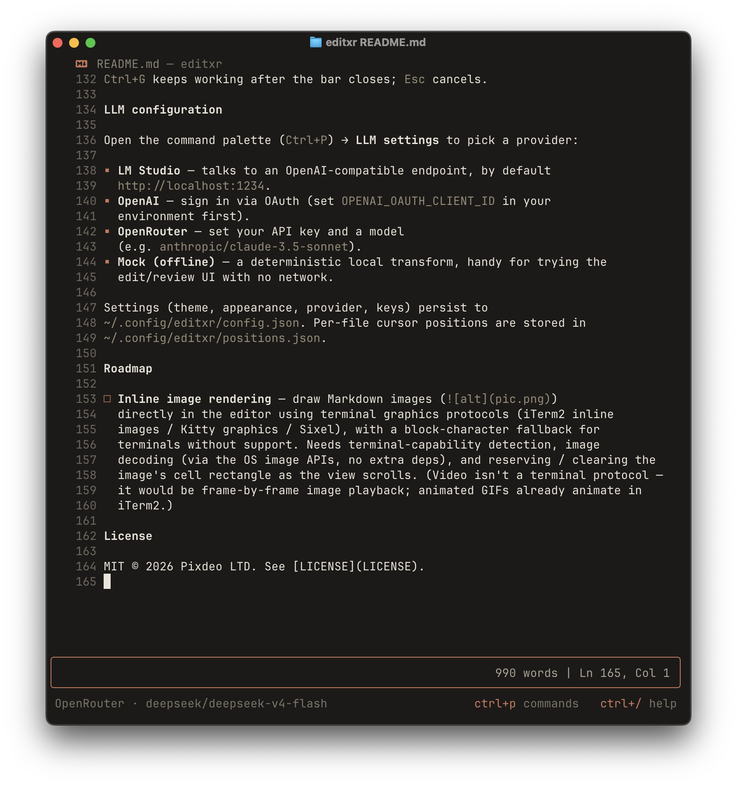
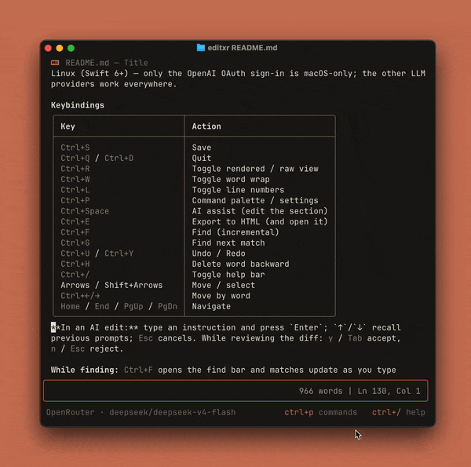

# editxr

A minimalist Markdown editor for the terminal, written in Swift. It renders
Markdown live as you type — a WYSIWYG terminal editor where headings, lists,
tables, and code are styled in place, not in a split preview — and lets you edit
whole sections with an LLM, shown as an inline diff you accept or reject. A
native Swift binary with zero dependencies, it opens instantly and stays fast on
large files.

```
test.md — My document

# Title

This is a **test** with *markdown*.

▪ Item 1
▪ Item 2
```

## Demo



**Themes** — pick a palette from the nested Themes menu with live preview, and
switch dark / light.



> **More clips coming:** live Markdown rendering, AI section editing, and
> find + HTML export.

## Features

- **Live Markdown rendering** — headings, emphasis, lists, task lists, tables,
  blockquotes, code blocks, and YAML frontmatter styled in place, while the line
  you're editing stays plain text.
- **AI section editing** — rewrite the selection or current block with an LLM
  and review it as a red/green inline diff: `y` to accept, `n` to reject.
  Prompt history recalls with ↑/↓.
- **Bring your own model** — LM Studio (local), OpenAI, OpenRouter, or an
  offline mock that needs no backend.
- **12 themes, light or dark** — Clay, One Dark Pro, Dracula, GitHub, Monokai,
  Solarized, Nord, Gruvbox, Tokyo Night, Catppuccin, Mono, and System, chosen
  from a rounded command palette (`Auto` follows your terminal background).
- **Incremental find** — `Ctrl+F` searches as you type; `Ctrl+G` steps through
  matches and wraps.
- **HTML export** — render the document to a clean, styled `.html` and open it
  (`Ctrl+E`).
- **Syntax highlighting** — code files (JSON, Swift, JS/TS, C-family, …) open
  token-coloured instead of as Markdown.
- **Quiet by design** — command palette (`Ctrl+P`), word wrap, line numbers,
  undo/redo, and per-file cursor memory, all out of the way until you want them.

## Philosophy

editxr is for writing prose and notes without ceremony. Three ideas guide it:

- **See it, don't preview it.** The document is the canvas — no split pane, no
  separate render window.
- **AI is an edit, not a conversation.** A model proposes a change to a section;
  you accept or reject it. Nothing lands that you didn't approve.
- **Local-first, yours to tweak.** Plain Swift, a hand-editable JSON config, and
  an offline mode — your terminal, your rules.

## Install

One-liner (builds from source; needs Xcode or the Command Line Tools):

```bash
curl -fsSL https://raw.githubusercontent.com/pixdeo/editxr/main/install.sh | bash
```

Homebrew (via the tap):

```bash
brew install pixdeo/tap/editxr
```

A signed, notarised universal binary is also attached to each
[release](https://github.com/pixdeo/editxr/releases).

## Build & run

editxr is a Swift Package. On most machines:

```bash
swift build -c release
swift run editxr path/to/file.md
```

A `build.sh` wrapper is included for environments where the default Xcode SDK
fails to compile (it uses the Command Line Tools toolchain):

```bash
./build.sh                 # debug build
./build.sh run file.md     # run
./build.sh install         # release build + copy to /usr/local/bin/editxr
```

Requires macOS 12+ and a Swift 5.9+ toolchain. It also builds and runs on
Linux (Swift 6+) — only the OpenAI OAuth sign-in is macOS-only; the other LLM
providers work everywhere.

## Keybindings

| Key | Action |
| --- | --- |
| `Ctrl+S` | Save |
| `Ctrl+Q` / `Ctrl+D` | Quit |
| `Ctrl+R` | Toggle rendered / raw view |
| `Ctrl+W` | Toggle word wrap |
| `Ctrl+L` | Toggle line numbers |
| `Ctrl+P` | Command palette / settings |
| `Ctrl+Space` | AI assist (edit the section) |
| `Ctrl+E` | Export to HTML (and open it) |
| `Ctrl+F` | Find (incremental) |
| `Ctrl+G` | Find next match |
| `Ctrl+U` / `Ctrl+Y` | Undo / Redo |
| `Ctrl+H` | Delete word backward |
| `Ctrl+/` | Toggle help bar |
| Arrows / Shift+Arrows | Move / select |
| `Ctrl+←/→` | Move by word |
| `Home` / `End` / `PgUp` / `PgDn` | Navigate |

**In an AI edit:** type an instruction and press `Enter`; `↑`/`↓` recall
previous prompts; `Esc` cancels. While reviewing the diff: `y` / `Tab` accept,
`n` / `Esc` reject.

**While finding:** `Ctrl+F` opens the find bar and matches update as you type
(case-insensitive), jumping to the first match. `Ctrl+G` (or `↓`/`→`) steps to
the next match and wraps; `↑`/`←` steps back. `Enter` keeps the matches so
`Ctrl+G` keeps working after the bar closes; `Esc` cancels.

## LLM configuration

Open the command palette (`Ctrl+P`) → **LLM settings** to pick a provider:

- **LM Studio** — talks to an OpenAI-compatible endpoint, by default
  `http://localhost:1234`.
- **OpenAI** — sign in via OAuth (set `OPENAI_OAUTH_CLIENT_ID` in your
  environment first).
- **OpenRouter** — set your API key and a model
  (e.g. `anthropic/claude-3.5-sonnet`).
- **Mock (offline)** — a deterministic local transform, handy for trying the
  edit/review UI with no network.

Settings (theme, appearance, provider, keys) persist to
`~/.config/editxr/config.json`. Per-file cursor positions are stored in
`~/.config/editxr/positions.json`.

## Roadmap

- [ ] **Homebrew tap** — publish `pixdeo/homebrew-tap` with the formula so
  `brew install pixdeo/tap/editxr` works.
- [ ] **Demo clips** — record the remaining demos (live rendering, AI editing,
  find + HTML export).
- [ ] **Inline image rendering** — draw Markdown images (``)
  directly in the editor using terminal graphics protocols (iTerm2 inline
  images / Kitty graphics / Sixel), with a block-character fallback for
  terminals without support. Needs terminal-capability detection, image
  decoding (via the OS image APIs, no extra deps), and reserving / clearing the
  image's cell rectangle as the view scrolls. (Video isn't a terminal protocol —
  it would be frame-by-frame image playback; animated GIFs already animate in
  iTerm2.)

## License

MIT © 2026 Pixdeo LTD. See [LICENSE](LICENSE).
