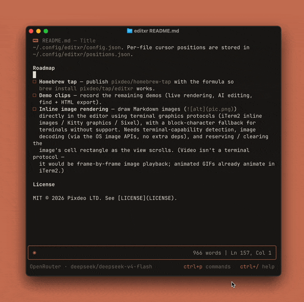
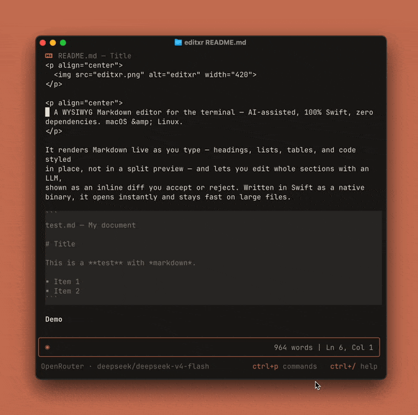
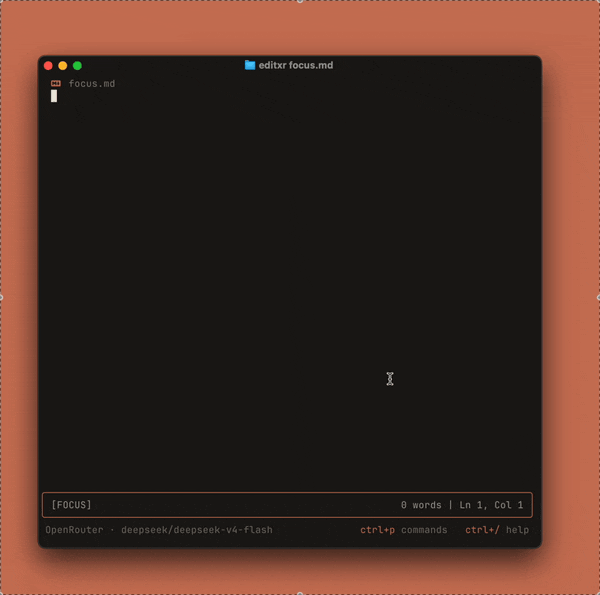
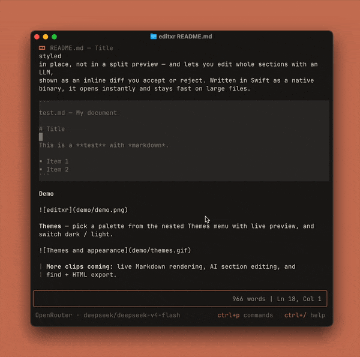
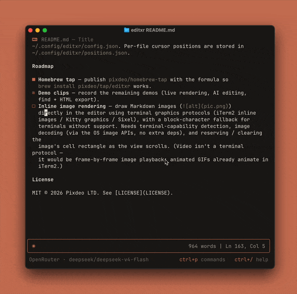
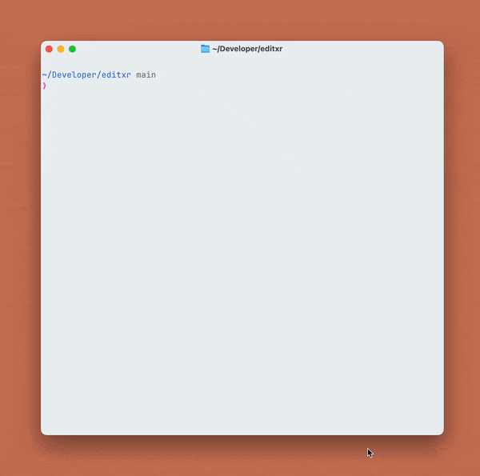

<p align="center">
  
</p>

<p align="center">
  A WYSIWYG Markdown editor for the terminal. AI-assisted, 100% Swift, zero dependencies. macOS &amp; Linux.
</p>

It renders Markdown live as you type: headings, lists, tables, and code are
styled in place, not in a split preview. You can hand a whole section to an LLM
and review its change as an inline diff before it lands. It's a native Swift
binary with no dependencies, so it opens instantly and stays fast on large files.

```
test.md — My document

# Title

This is a **test** with *markdown*.

• Item 1
• Item 2
```

## Demo


**Renders as you type.** Markdown is styled in place; the line you're on stays raw.



**AI section editing.** Describe a change and review it as an inline diff.



**Themes.** Light or dark, from the command palette.


**Focus mode.** Dim everything but the line — or word — you're on. `Ctrl+B`.



**Rendered or raw.** Flip the view with `Ctrl+R`.



**Incremental find.** `Ctrl+F` to search, `Ctrl+G` to step through matches.



**Opens instantly.** Even on large files.



## Features

- **Live Markdown rendering.** Headings, emphasis, lists, task lists, tables,
  blockquotes, code blocks, and YAML frontmatter are styled in place, while the
  line you're editing stays plain text.
- **Multi-file workspace.** Open files in tabs (`editxr a.md b.md`, or `Ctrl+O`
  to fuzzy-find any file in the folder tree). `Ctrl+N` cycles tabs, `Ctrl+[`
  goes back to the previous file, `Ctrl+W` closes the tab.
- **Navigable links.** `[text](file.md)` and Obsidian-style `[[wikilinks]]`
  render collapsed to their underlined title and open on `Ctrl+]` or a click —
  local files in a tab, `http(s)`/`mailto` in the browser. The raw form reveals
  when the cursor lands on the link, so it stays editable.
- **AI section editing.** Rewrite the selection or current block with an LLM and
  review it as a red/green inline diff: `y` to accept, `n` to reject. Prompt
  history recalls with ↑/↓.
- **Bring your own model.** LM Studio (local), OpenAI, OpenRouter, or an offline
  mock that needs no backend.
- **12 themes, light or dark.** Clay, One Dark Pro, Dracula, GitHub, Monokai,
  Solarized, Nord, Gruvbox, Tokyo Night, Catppuccin, Mono, and System, chosen
  from a rounded command palette (`Auto` follows your terminal background).
- **Incremental find.** `Ctrl+F` searches as you type; `Ctrl+G` steps through
  matches and wraps.
- **HTML export.** Render the document to a styled `.html` and open it (`Ctrl+E`).
- **Syntax highlighting.** Code files (JSON, Swift, JS/TS, C-family, …) open
  token-coloured instead of as Markdown.
- **Quiet by design.** Command palette (`Ctrl+P`), word wrap, line numbers,
  undo/redo, and per-file cursor memory, all out of the way until you want them.

## Philosophy

In editxr you see the rendered result directly, without a separate preview pane.
The line under your cursor stays raw text you can edit, and everything else is
rendered, so you're always editing the real file. For a full render, press
`Ctrl+E` to open the document as HTML in your browser.

The AI works the same way: it suggests a change and you approve it. You pick a
section, describe what you want, and get a diff to accept or reject. There's no
chat to manage, and nothing is applied behind your back.

It stays local-first: plain Swift, a JSON config you can hand-edit, and an
offline mode, so it runs with no account and no network.

## Install

One-liner (downloads the prebuilt binary for your platform; falls back to
building from source):

```bash
curl -fsSL https://raw.githubusercontent.com/pixdeo/editxr/main/install.sh | bash
```

Homebrew (via the tap):

```bash
brew install pixdeo/tap/editxr
```

Prebuilt binaries are attached to every
[release](https://github.com/pixdeo/editxr/releases):

| Platform | Package |
| --- | --- |
| macOS (Apple Silicon + Intel) | `editxr-<version>-macos-universal.zip` — signed & notarised universal binary |
| Linux x86_64 | `editxr-<version>-linux-x86_64.tar.gz` — static (musl), no dependencies |
| Linux aarch64 | `editxr-<version>-linux-aarch64.tar.gz` — static (musl), no dependencies |

The Linux binaries are statically linked against musl, so a single download runs
on any distro (Ubuntu, Debian, Alpine, Fedora, …) with no Swift runtime
installed. To build from source instead, pass `FROM_SOURCE=1` to the installer.

## Build & run

editxr is a Swift Package. On most machines:

```bash
swift build -c release
swift run editxr path/to/file.md
```

A `build.sh` wrapper is included for environments where the default Xcode SDK
fails to compile (it uses the Command Line Tools toolchain):

```bash
./build.sh                 # debug build
./build.sh run file.md     # run
./build.sh install         # release build + copy to /usr/local/bin/editxr
```

Requires macOS 12+ and a Swift 5.9+ toolchain. It also builds and runs on
Linux (Swift 6+); there, only the OpenAI OAuth sign-in is unavailable, and the
other LLM providers work as usual.

## Keybindings

| Key | Action |
| --- | --- |
| `Ctrl+S` | Save |
| `Ctrl+Q` / `Ctrl+D` | Quit |
| `Ctrl+R` | Toggle rendered / raw view |
| `Ctrl+O` | Open file (fuzzy quick-switcher) |
| `Ctrl+N` | Next tab |
| `Ctrl+W` | Close tab |
| `Ctrl+]` | Follow link under cursor (or click a link) |
| `Ctrl+[` / `Esc` | Back to the previous file |
| `Ctrl+T` | Cycle task state (`[ ]` → `[*]` → `[x]`) |
| `Ctrl+L` | Toggle line numbers |
| `Ctrl+P` | Command palette / settings |
| `Ctrl+Space` | AI assist (edit the section) |
| `Ctrl+E` | Export to HTML (and open it) |
| `Ctrl+F` | Find (incremental) |
| `Ctrl+G` | Find next match |
| `Ctrl+C` / `Ctrl+X` / `Ctrl+V` | Copy / cut / paste (system clipboard) |
| `Ctrl+U` / `Ctrl+Y` | Undo / Redo |
| `Ctrl+H` / `⌥⌫` | Delete word backward |
| `Ctrl+/` | Keyboard shortcuts (searchable panel) |
| Arrows / Shift+Arrows | Move / select |
| Mouse | Wheel scrolls; click places the cursor (or follows a link); drag selects |
| `Ctrl+←/→` | Move by word |
| `Home` / `End` / `PgUp` / `PgDn` | Navigate |

**In an AI edit:** type an instruction and press `Enter`; `↑`/`↓` recall
previous prompts; `Esc` cancels. While reviewing the diff: `y` / `Tab` accept,
`n` / `Esc` reject.

**While finding:** `Ctrl+F` opens the find bar and matches update as you type
(case-insensitive), jumping to the first match. `Ctrl+G` (or `↓`/`→`) steps to
the next match and wraps; `↑`/`←` steps back. `Enter` keeps the matches so
`Ctrl+G` keeps working after the bar closes; `Esc` cancels.

## LLM configuration

Open the command palette (`Ctrl+P`) → **LLM settings** to pick a provider:

- **LM Studio.** Talks to an OpenAI-compatible endpoint, by default
  `http://localhost:1234`.
- **OpenAI.** Sign in via OAuth (set `OPENAI_OAUTH_CLIENT_ID` in your
  environment first).
- **OpenRouter.** Set your API key and a model
  (e.g. `anthropic/claude-3.5-sonnet`).
- **Mock (offline).** A deterministic local transform for trying the edit/review
  UI with no network.

Settings (theme, appearance, provider, keys) persist to
`~/.config/editxr/config.json`. Per-file cursor positions are stored in
`~/.config/editxr/positions.json`.

## Roadmap

- [ ] **Second-brain / multi-file editing.** Grow editxr from a single-document
  editor toward an Obsidian-like workspace, in order of difficulty: (1) tabs for
  multiple open files ✅; (2) recursive directory scan with a fuzzy quick-switcher
  (`Ctrl+O`) ✅; (3) navigable `[text](path)` and `[[wikilinks]]` that open in a
  tab; (4) a sidebar file list (`editxr ./folder` opens a folder); (5) a live
  backlinks panel (a link graph re-indexed on save). Prerequisite for the
  sidebar/panels: extract a **render compositor** so regions render into their
  own width and compose horizontally (the ANSI/display-width splicing primitive
  already exists in `spliceVisible`), instead of each renderer assuming it owns
  the full content width.
- [ ] **Page-wise keyboard selection that survives the terminal.** Shift+PageUp/
  PageDown selection is wired, but Terminal.app and iTerm2 bind those to their
  own scrollback by default, so the app never receives them. Add an alternative
  keybinding for page selection that terminals don't intercept.
- [ ] **Windows support.** editxr is POSIX-only today (`termios`, `ioctl`,
  signals, `/dev/tty`). Porting it means putting those behind a small platform
  layer with a Windows console backend (`GetConsoleMode` / VT processing). If you
  want to take it on, [`PORTING_TO_WINDOWS.md`](PORTING_TO_WINDOWS.md) maps every
  blocker to its Windows replacement, with a file:line table and a work
  checklist.
- [ ] **Homebrew tap.** Publish `pixdeo/homebrew-tap` with the formula so
  `brew install pixdeo/tap/editxr` works.
- [ ] **Inline image rendering.** Draw Markdown images (``)
  directly in the editor using terminal graphics protocols (iTerm2 inline
  images / Kitty graphics / Sixel), with a block-character fallback for
  terminals without support. Needs terminal-capability detection, image
  decoding (via the OS image APIs, no extra deps), and reserving / clearing the
  image's cell rectangle as the view scrolls. (Video isn't a terminal protocol;
  it would be frame-by-frame image playback, and animated GIFs already animate
  in iTerm2.)

## License

MIT © 2026 Pixdeo LTD. See [LICENSE](LICENSE).
